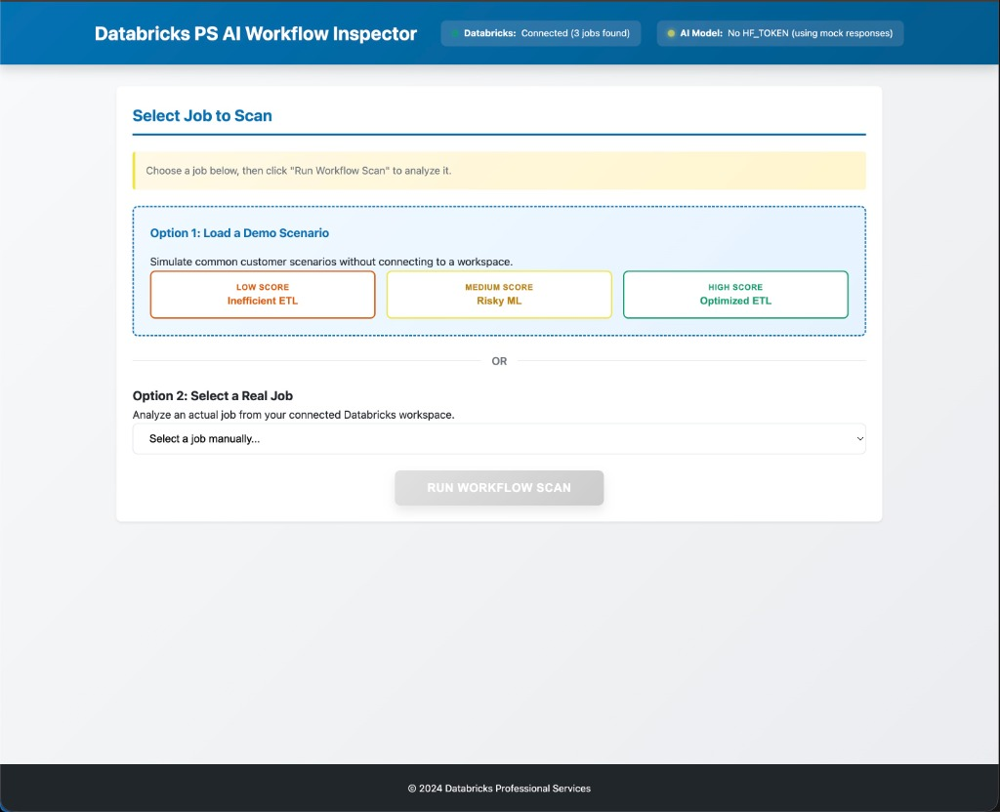
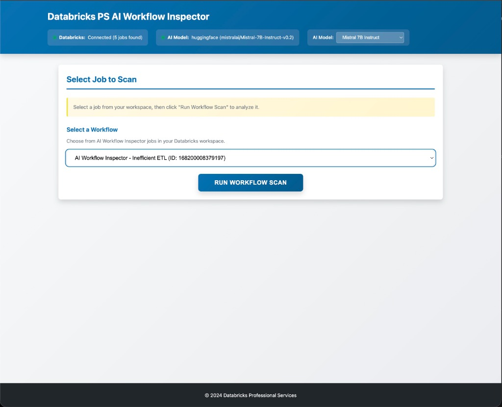
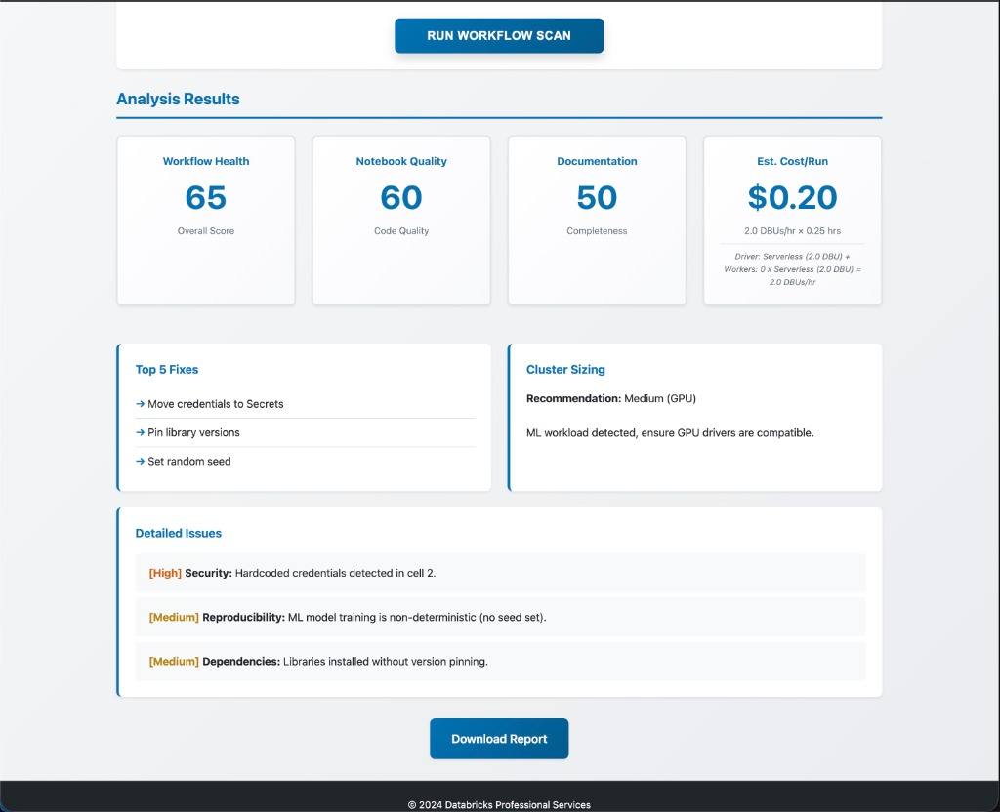

# Databricks PS AI Workflow Inspector

A professional tool for scanning, analyzing, and documenting Databricks Jobs & Notebooks using the Databricks CLI, Python, and LLMs.


---

## 📌 Project Goal
This tool allows Professional Services (PS) teams to quickly inspect a client's Databricks environment, analyze workflow health, and generate actionable reports using Generative AI. It bridges the gap between manual code reviews and automated optimization.

## 🏗️ Architecture

### System Overview
```
┌─────────────────────────────────────────────────────────────┐
│                       Frontend (Browser)                     │
│  ┌────────────────┐  ┌──────────────┐  ┌─────────────────┐ │
│  │  index.html    │  │   app.js     │  │   styles.css    │ │
│  │  (UI Layout)   │  │  (Logic)     │  │  (Styling)      │ │
│  └────────────────┘  └──────────────┘  └─────────────────┘ │
└─────────────────────────────────────────────────────────────┘
                            │ HTTP/REST
                            ▼
┌─────────────────────────────────────────────────────────────┐
│                    FastAPI Backend (Python)                  │
│  ┌──────────────────────────────────────────────────────┐   │
│  │  app.py (API Endpoints)                              │   │
│  │  • GET /jobs       • GET /status                     │   │
│  │  • POST /scan/{id} • GET /report/{id}/pdf            │   │
│  └──────────────────────────────────────────────────────┘   │
│                            │                                 │
│  ┌────────────────┐  ┌─────────────────┐  ┌──────────────┐ │
│  │  dbx_client.py │  │  analyzer.py    │  │ model_       │ │
│  │  (Databricks   │  │  (Workflow      │  │ selector.py  │ │
│  │   CLI Wrapper) │  │   Analysis)     │  │ (LLM API)    │ │
│  └────────────────┘  └─────────────────┘  └──────────────┘ │
│         │                     │                    │         │
│  ┌──────────────────┐  ┌─────────────────────────────────┐ │
│  │ cost_calculator  │  │  report_generator.py            │ │
│  │ .py (DBU/Cost)   │  │  (Markdown + PDF)               │ │
│  └──────────────────┘  └─────────────────────────────────┘ │
└─────────────────────────────────────────────────────────────┘
           │                                         │
           ▼                                         ▼
┌─────────────────────┐                   ┌──────────────────┐
│  Databricks CLI     │                   │  LLM Provider    │
│  • Job Metadata     │                   │  • HuggingFace   │
│  • Notebook Source  │                   │  • Databricks    │
│  • Run History      │                   │    Serving       │
└─────────────────────┘                   └──────────────────┘
```

### Data Flow
1. **User Selection**: User selects a job (demo or real) via the frontend.
2. **Job Retrieval**: Backend fetches job details via Databricks CLI.
3. **Cost Calculation**: `cost_calculator.py` estimates cost based on cluster config and run history.
4. **AI Analysis**: Notebook code is sent to LLM for quality assessment.
5. **Report Generation**: Results are compiled into Markdown/PDF reports.
6. **Display**: Frontend shows scores, cost estimates, and actionable recommendations.

## 🧰 Tech Stack

### Backend
- **Framework**: FastAPI (Python 3.8+)
- **Databricks Integration**: Databricks CLI (subprocess calls)
- **AI/LLM**: 
  - HuggingFace Inference API (Mistral-7B-Instruct)
  - Databricks Model Serving (DBRX)
- **Cost Calculation**: Custom DBU-based pricing engine
- **Report Generation**: Markdown + WeasyPrint (PDF)

### Frontend
- **HTML5**: Semantic, accessible structure
- **Vanilla JavaScript**: No framework dependencies
- **CSS3**: Custom colorblind-safe design system
- **API Communication**: Fetch API (RESTful)

### Infrastructure
- **Server**: Uvicorn (ASGI)
- **Environment**: Python venv
- **Configuration**: `.env` files (dotenv)
- **CLI Tools**: Databricks CLI v0.18.0+

### Key Libraries
```
fastapi           # Web framework
uvicorn          # ASGI server
python-dotenv    # Environment config
requests         # HTTP client for LLM APIs
```

## 📸 Dashboard Overview

### 1. Flexible Job Selection
The dashboard offers two distinct modes for engagement:
- **Demo Scenarios**: Pre-loaded examples (Inefficient, Risky, Optimized) to demonstrate capabilities without a live workspace.
- **Real Job Selection**: Connects to the client's Databricks workspace to list and analyze actual production jobs.



### 2. Workflow Analysis
Once a job is selected (either demo or real), the tool scans the job configuration, cluster settings, and notebook code.



### 3. Comprehensive Results
The analysis provides immediate, data-driven insights:
- **Health Scores**: 0-100 ratings for Workflow Health, Code Quality, and Documentation.
- **Cost Estimation**: Real-time cost-per-run calculation based on cluster instance types and duration.
- **Actionable Fixes**: Prioritized recommendations (e.g., "Move credentials to Secrets", "Pin library versions").
- **Detailed Issues**: Specific findings categorized by severity (High/Medium/Low).



---

## 🚀 Features
- **Job Inspection**: Lists all jobs via Databricks CLI.
- **Deep Scan**: Downloads notebook source code and configuration.
- **AI Analysis**: Uses LLMs (Databricks DBRX or Mistral-7B) to evaluate:
  - Notebook quality & Python best practices
  - SQL efficiency
  - Cluster sizing & cost optimization
  - Documentation completeness
- **Cost Optimization Engine**:
  - Calculates estimated cost per run
  - Identifies expensive cluster configurations (e.g., GPU over-provisioning)
  - Suggests cheaper alternatives (e.g., "Downsize to m5.xlarge")
- **Reporting**: Generates a comprehensive Markdown and PDF report.
- **UI**: Responsive, colorblind-safe web interface.

## 📂 Structure
```
databricks-ps-workflow-inspector/
├── backend/            # FastAPI application & Analysis logic
├── frontend/           # Vanilla JS/HTML/CSS UI
├── assets/             # Images and static resources
├── outputs/            # Generated reports and logs
└── start.sh            # One-click startup script
```

## 🛠️ Prerequisites
1. **Python 3.8+**
2. **Databricks CLI**: Installed and configured (`databricks configure`).
   - Ensure you can run `databricks jobs list` in your terminal.
3. **LLM Access** (Optional for demo, required for real analysis):
   - Set `HF_TOKEN` environment variable for HuggingFace (Mistral).
   - OR configure Databricks Serving in `backend/model_selector.py`.

## 🏁 Quick Start

1. **Clone & Navigate**
   ```bash
   cd databricks-ps-workflow-inspector
   ```

2. **Run the Application**
   ```bash
   ./start.sh
   ```
   This script will:
   - Create a virtual environment
   - Install dependencies
   - Start the FastAPI server

3. **Access the UI**
   Open your browser to [http://localhost:8000](http://localhost:8000)

## 🧪 How to Test (Interview Demo)
1. **Setup**:
   - Ensure `.env` is configured with your Databricks credentials.
   - Run `./start.sh` to launch the backend and frontend.

2. **Run the Demo**:
   - Open [http://localhost:8000](http://localhost:8000).
   - Select one of the pre-configured demo jobs:
     - **Inefficient Legacy ETL** (ID: 576914796776653) -> Expect Low Score (~$0.20/run)
     - **Risky ML Pipeline** (ID: 392290392510064) -> Expect Medium Score (~$0.50/run)
     - **Optimized ETL** (ID: 900088613589267) -> Expect High Score (~$3.60/run)
   - Click **"Run Workflow Scan"**.
   - View the generated report and download the PDF.

## 🛡️ Security Note
- This project uses a `.env` file for credentials. **DO NOT commit this file to GitHub.**
- A `.gitignore` has been included to prevent accidental commits of secrets.

---
*Built for the Databricks Professional Services Team.*
