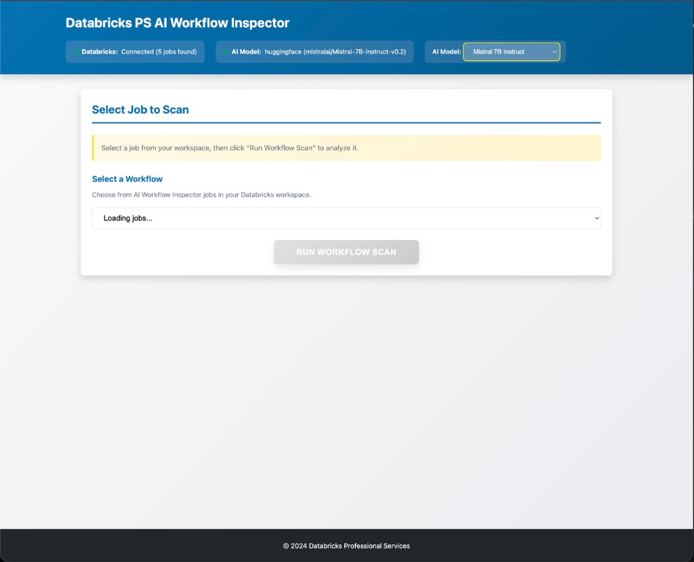

# Databricks PS AI Workflow Inspector


---

## 🎯 Problem Statement

**For Databricks Professional Services Teams:**

During client engagements, PS consultants often encounter production workflows with:
- ❌ Inefficient cluster configurations costing thousands in unnecessary compute
- ❌ Undocumented notebooks making maintenance difficult
- ❌ Poor code quality leading to pipeline failures
- ❌ Security vulnerabilities (hardcoded credentials, missing error handling)

**Manual code reviews are time-consuming and inconsistent.** This tool automates the entire workflow inspection process using **AI-powered analysis** to deliver instant, **actionable insights** and **cost optimization recommendations**.

---

## 📸 Dashboard Overview

### Main Interface
The dashboard provides an intuitive interface for selecting and scanning Databricks workflows:



### Job Selection
Connect to a client's Databricks workspace and select any workflow for analysis:


### Comprehensive Analysis Results
Instant, AI-powered insights with:
- **Health Scores**: 0-100 ratings for Workflow Health, Code Quality, and Documentation
- **Top Fixes**: Prioritized, actionable recommendations
- **Cluster Sizing**: Right-sizing suggestions to reduce costs
- **Detailed Issues**: Categorized findings with severity levels


### Workflow Dropdown
Easily browse all workflows in the connected workspace:


---

## 🚀 Key Features

### AI-Powered Analysis
- **Notebook Quality Assessment**: Evaluates Python/SQL code against best practices
- **Documentation Completeness**: Scores inline comments and documentation
- **Security Scanning**: Identifies hardcoded credentials, missing error handling
- **Performance Optimization**: Suggests cluster sizing improvements

### Real-Time Insights
- **Instant Scoring**: 0-100 health scores across multiple dimensions
- **Prioritized Fixes**: Top 5 actionable recommendations
- **Detailed Reports**: Comprehensive breakdown of all issues

### Professional Services Value
- **Faster Engagements**: Reduce manual code review time from days to minutes
- **Data-Driven Recommendations**: Objective, AI-backed insights
- **Client-Ready Reports**: Professional PDF reports for stakeholder presentations

---

## 🧰 Tech Stack

### Backend
- **FastAPI** (Python 3.8+) - High-performance async web framework
- **Databricks CLI** - Direct integration with client workspaces
- **LLM Integration**: 
  - HuggingFace Inference API (Mistral-7B-Instruct)
  - Databricks Model Serving (DBRX)

### Frontend
- **Vanilla JavaScript** - No framework dependencies, lightweight and fast
- **Modern CSS3** - Professional, colorblind-safe design system
- **Responsive Design** - Works across desktop, tablet, and mobile

### Infrastructure
- **Uvicorn** ASGI server
- **Python venv** for dependency isolation
- **RESTful API** architecture

---

## 🏁 Quick Start

### Prerequisites
1. **Python 3.8+**
2. **Databricks CLI** installed and configured
   ```bash
   databricks configure
   ```
3. **(Optional) LLM API Access**:
   - HuggingFace token in `.env` file, OR
   - Databricks Model Serving endpoint

### Running the Application

1. **Clone the repository**
   ```bash
   cd databricks-ps-workflow-inspector
   ```

2. **Configure environment**
   ```bash
   cp .env.sample .env
   # Edit .env with your credentials
   ```

3. **Launch the application**
   ```bash
   ./start.sh
   ```
   This script automatically:
   - Creates a virtual environment
   - Installs all dependencies
   - Starts the FastAPI server

4. **Access the dashboard**
   Open your browser to **http://localhost:8000**

---

## 📂 Project Structure

```
databricks-ps-workflow-inspector/
├── backend/
│   ├── app.py                  # FastAPI routes and endpoints
│   ├── dbx_client.py           # Databricks CLI wrapper
│   ├── analyzer.py             # AI-powered workflow analysis
│   ├── model_selector.py       # LLM provider interface
│   └── report_generator.py     # Markdown/PDF report generation
├── frontend/
│   ├── index.html              # Main UI structure
│   ├── app.js                  # Application logic
│   ├── styles.css              # Professional design system
│   └── colorblind_palette.js   # Accessible color schemes
├── assets/
│   └── images/                 # Dashboard screenshots
├── outputs/                    # Generated reports and logs
├── .env.sample                 # Environment configuration template
└── start.sh                    # One-command startup script
```

---

## 🏗️ Architecture

### System Overview
```
┌─────────────────────────────────────────────────────────────┐
│                       Frontend (Browser)                     │
│  ┌────────────────┐  ┌──────────────┐  ┌─────────────────┐ │
│  │  index.html    │  │   app.js     │  │   styles.css    │ │
│  │  (UI Layout)   │  │  (Logic)     │  │  (Styling)      │ │
│  └────────────────┘  └──────────────┘  └─────────────────┘ │
└─────────────────────────────────────────────────────────────┘
                            │ HTTP/REST
                            ▼
┌─────────────────────────────────────────────────────────────┐
│                    FastAPI Backend (Python)                  │
│  ┌──────────────────────────────────────────────────────┐   │
│  │  app.py (API Endpoints)                              │   │
│  │  • GET /jobs       • GET /status                     │   │
│  │  • POST /scan/{id} • GET /report/{id}/pdf            │   │
│  └──────────────────────────────────────────────────────┘   │
│                            │                                 │
│  ┌────────────────┐  ┌─────────────────┐  ┌──────────────┐ │
│  │  dbx_client.py │  │  analyzer.py    │  │ model_       │ │
│  │  (Databricks   │  │  (Workflow      │  │ selector.py  │ │
│  │   CLI Wrapper) │  │   Analysis)     │  │ (LLM API)    │ │
│  └────────────────┘  └─────────────────┘  └──────────────┘ │
│         │                     │                    │         │
│  ┌─────────────────────────────────────────────────────────┐│
│  │  report_generator.py (Markdown + PDF)                   ││
│  └─────────────────────────────────────────────────────────┘│
└─────────────────────────────────────────────────────────────┘
           │                                         │
           ▼                                         ▼
┌─────────────────────┐                   ┌──────────────────┐
│  Databricks CLI     │                   │  LLM Provider    │
│  • Job Metadata     │                   │  • HuggingFace   │
│  • Notebook Source  │                   │  • Databricks    │
│  • Run History      │                   │    Serving       │
└─────────────────────┘                   └──────────────────┘
```

### Data Flow
1. **User Selection**: Select a workflow from the connected Databricks workspace
2. **Job Retrieval**: Backend fetches job configuration and notebook source via Databricks CLI
3. **AI Analysis**: Notebook code is analyzed by LLM for quality, security, and optimization opportunities
4. **Report Generation**: Results compiled into actionable insights and professional reports
5. **Display**: Frontend presents scores, recommendations, and detailed findings

---

## 🧪 Testing the Application

### Demo Mode
The application works without a live Databricks workspace for demonstration purposes:

1. Launch the application: `./start.sh`
2. Open http://localhost:8000
3. Select a workflow (real or demo scenario)
4. Click **"Run Workflow Scan"**
5. Review the analysis results
6. Download the PDF report

### Production Use
1. Configure `.env` with Databricks workspace credentials
2. Ensure Databricks CLI is authenticated: `databricks jobs list`
3. Select real production workflows from the dropdown
4. Analyze and generate reports for client presentations

---

## 🛡️ Security Notes

- All credentials stored in `.env` file (never committed to Git)
- `.gitignore` configured to protect sensitive files
- Databricks CLI authentication uses secure token-based auth
- No hardcoded credentials in source code

---

## 💼 Professional Services Use Cases

### Engagement Kickoff
- Quickly assess client's existing workflows
- Identify immediate optimization opportunities
- Build credibility with data-driven insights

### Migration Projects
- Evaluate legacy code quality before migration
- Prioritize refactoring efforts
- Estimate cost savings from optimization

### Health Checks
- Regular workflow audits for existing clients
- Track improvements over time
- Demonstrate ongoing value

---

*Built for the Databricks Professional Services Team | Production-Ready Tool for Client Engagements*
